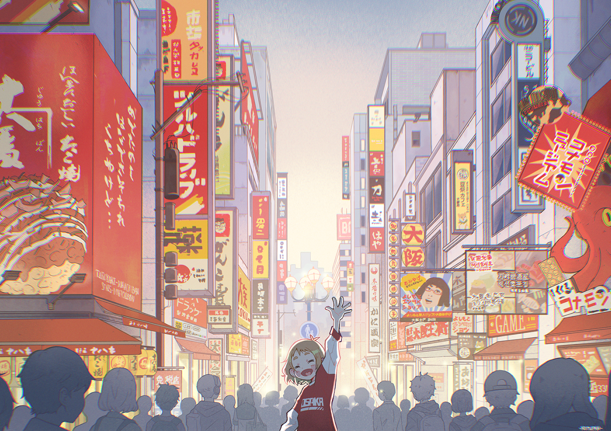

<!-- Animated GIF Header -->

  
  
<a href="https://makrustic.tumblr.com/" name="MAK">mak</a>

---------------------------------------------------------------------

<!-- About Me Section -->
<h3 align="center"> João Pedro Blagitz Ravache</h3>

 

<h3 align="left">💫 Sobre Mim</h3>

<h4>
- 👨‍🎓 Estudando <a href="https://slt.ifsp.edu.br/index.php/component/content/article?id=510">Engenharia de Controle e Automação</a> no Instituto Federal de São Paulo - Campus Salto 
- 📖 Focado a aprender e me desenvolver 
- ⚡ Interessado em Automação Industrial, IoT, Sistemas Embarcados e Robótica 
- 📫 Email para contato: <strong>joaobravache@gmail.com</strong>

<!-- Skills Section -->
<h3 align="center">🚀 Linguagens & Ferramentas</h3>

    
   

<!-- git stat-->
<h3 align="center">🌱 Github Status</h3>
 

  
  
  
<!-- Proudly created with GPRM ( https://gprm.itsvg.in ) -->

 

<!-- Activity Graph -->
<h3 align="center">📊 Atividade de Contribuição</h3>

  

<!-- ending

  
  
<a href="https://www.nemupan.com/gallery" name="NEMUPAN">nemupan</a>

-->
<!--

  
⚠️ Esse README é unicamente projetado por <strong>João Ravache</strong>.

-->
